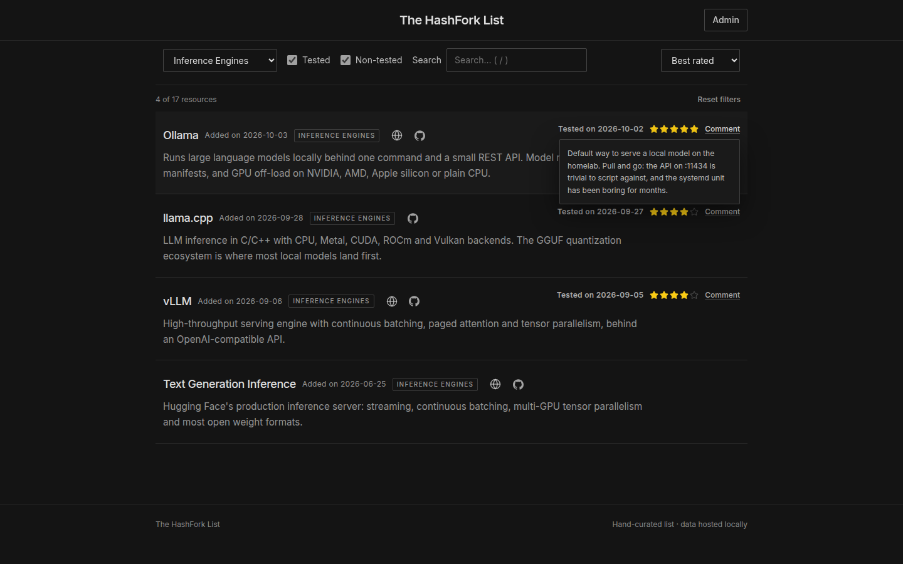
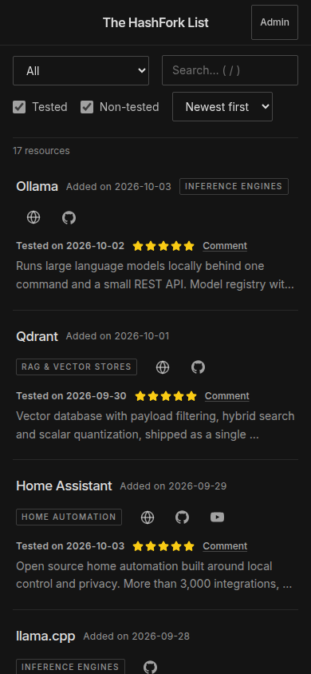
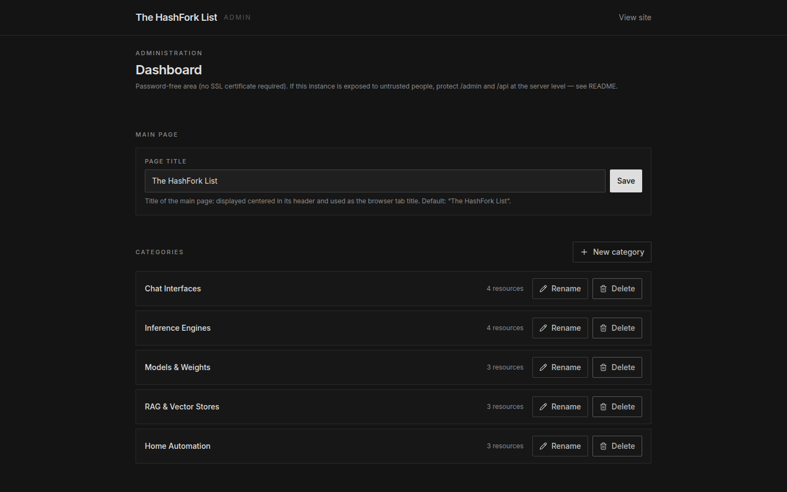
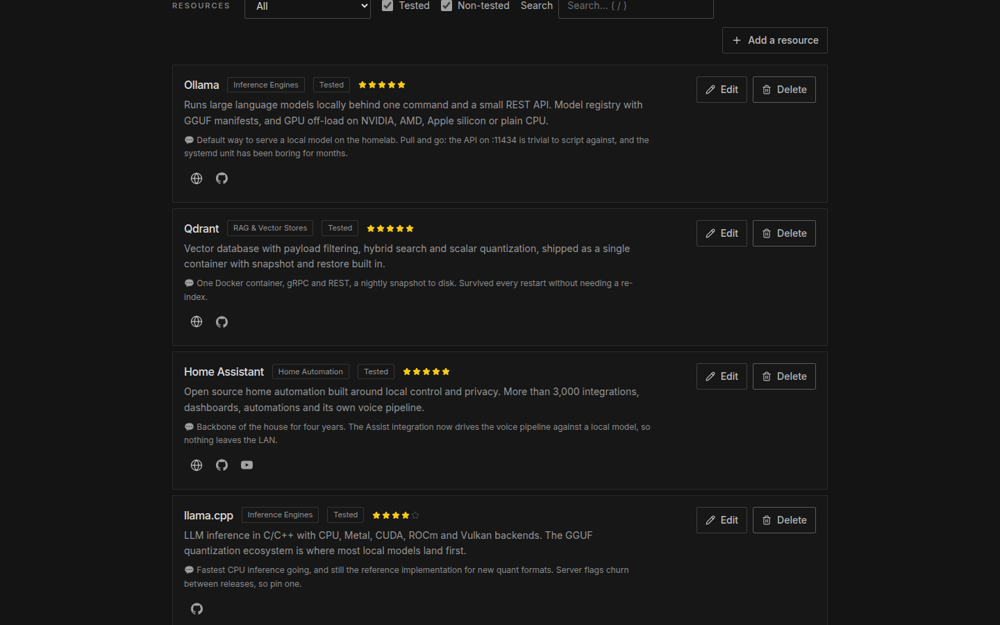

# The HashFork List

A self-hosted directory of curated resources: GitHub projects, LLMs, models and AI tools. It comes with a clean public list and a simple admin screen, and it runs as one Node.js process on top of a single SQLite file.

**Stack:** Next.js (App Router) · TypeScript · React · Tailwind CSS · SQLite

**This build has no admin login.** No accounts, no passwords, no cookies, so it also needs no SSL/TLS certificate to run.


---

## What you get

**Public list** (`/`)

- Resources grouped by category, each with a name, description, links, a category chip and review metadata.
- Links are shown as icons: GitHub, website, Hugging Face, YouTube.
- A "Tested" badge with the date it was checked, a star rating from 0 to 5 (drawn on a 5-slot scale), and an optional comment behind a "Comment" button (tap- and keyboard-friendly).
- Filter bar: category, Tested / Non-tested, and a case-insensitive search over name, description and comment. All three combine, and a sort control orders the list by newest, name or rating.
- A live result count ("12 of 31 resources") sits under the filter bar with a "Reset filters" shortcut. Filters and sort are mirrored into the URL query string (`/?category=…&tested=0&q=…&sort=rating`), so a view can be bookmarked, shared, and restored after a refresh.
- Press `/` anywhere to jump to the search field; `Esc` clears it.
- Descriptions are clamped to two lines; clicking/tapping, hovering or keyboard-focus reveals the full text in a popover.

**Admin area** (`/admin`)

- Edit the main page title, categories and resources; export and import the data.
- Same filter bar as the public list.
- Forms refuse to close with unsaved changes: you get **Save / Discard changes / Keep editing**.
- Deleting a category keeps its resources (they simply become uncategorized).

**What it deliberately leaves out**

- No authentication of any kind. Anyone who can reach `/admin` can edit content; see [Security model](#what-the-app-does-and-does-not-protect).
- No external database or SaaS backend. Everything is one local SQLite file.
- No third-party scripts, fonts or analytics; the Content-Security-Policy allow-lists nothing outside the app itself. The Inter typeface is self-hosted (bundled from `@fontsource-variable/inter` at build time, served from the same origin).

---

## Table of contents

1. [Quick start](#quick-start)
2. [Screenshots](#screenshots)
3. [Scripts](#scripts)
4. [Environment variables](#environment-variables)
5. [How the data is stored](#how-the-data-is-stored)
6. [Using the admin area](#using-the-admin-area)
7. [Backup and restore](#backup-and-restore)
8. [Schema migrations](#schema-migrations)
9. [Security model](#security-model)
10. [Deployment](#deployment)
11. [Project structure](#project-structure)
12. [Testing](#testing)
13. [Troubleshooting](#troubleshooting)

---

## Screenshots

Every image below comes from a production build (`npm run build` then `npm run start`) running against a demo database with 17 resources in 5 categories. The image at the top of this file is the default public view.

### Public list

Filters and sort mirrored into the URL (`/?category=inference-engines&sort=rating`), with the live result count, the "Reset filters" shortcut, and an open comment popover.



The same list on a phone-sized viewport (390 px wide): the filter bar wraps to two rows and every resource stacks its metadata under the title.



### Admin area

The dashboard at `/admin`: the main page title and the category list with its per-category resource counts.



The Resources section, which carries the same filter bar as the public list.



The resource editor for a single entry: category, name, description, the four link fields, the star rating, the Tested checkbox with its stored check date, and the comment.


---

## Quick start

You need **Node.js 22 or newer**. Node 24 LTS is what the Docker image uses and what this README assumes.

```bash
npm install
cp .env.example .env   # optional, every value has a working default
npm run dev            # http://localhost:3000
```

Then open:

- <http://localhost:3000> for the public list
- <http://localhost:3000/admin> for the admin area, which opens straight into the dashboard with no login screen

To build and serve the production bundle:

```bash
npm run build
npm run start          # listens on PORT, default 3000
```

## Scripts

| Command                | What it does                                       |
| ---------------------- | -------------------------------------------------- |
| `npm run dev`          | Dev server with hot reload                         |
| `npm run build`        | Production build (also emits `.next/standalone`)   |
| `npm run start`        | Serve the production build                         |
| `npm run typecheck`    | Type check only (`tsc --noEmit`)                   |
| `npm test`             | Run the test suite once (Vitest)                   |
| `npm run test:watch`   | Run tests in watch mode                            |

## Environment variables

Every variable is optional. There is no secret to configure, because there are no passwords and no sessions. Copy `.env.example` to `.env` only when you want to change a default.

| Variable          | Default                 | Meaning                                                                        |
| ----------------- | ----------------------- | ------------------------------------------------------------------------------ |
| `DATA_DIR`        | `./data`                | Folder that holds the SQLite database. **Must be persistent storage in production.** |
| `DATABASE_FILE`   | `hashfork.sqlite`       | Database file name inside `DATA_DIR`.                                          |
| `APP_URL`         | `http://localhost:3000` | Public origin. Used for metadata and as the allowed host for write requests.   |
| `TRUST_PROXY`     | `true`                  | Read client IP/host from `X-Forwarded-*`. Set `false` when not behind a proxy. |
| `ENABLE_HSTS`     | `false`                 | Send `Strict-Transport-Security`. Turn on only when you serve over HTTPS.      |

## How the data is stored

One local SQLite database. No Supabase, Firebase, hosted Postgres, Airtable or Notion, and no `localStorage` pretending to be a database.

```
data/                      <- DATA_DIR, this is what you back up
  hashfork.sqlite          <- the database (WAL mode)
  hashfork.sqlite-wal      <- write-ahead log (transient)
  hashfork.sqlite-shm      <- shared-memory index (transient)
```

Three tables: `categories`, `items`, and `settings` (key/value, currently the main page title). Earlier builds had `admin`, `sessions` and `rate_limits`; migration v2 drops them on upgrade.

Nothing outside the repository layer touches SQLite: React components and route handlers go through `lib/db/repositories/*`. Swapping SQLite for PostgreSQL later means reimplementing those three files and nothing else.

Your data survives restarts as long as `DATA_DIR` sits on persistent storage.

## Using the admin area

`/admin` is the whole content-management screen: main page title, categories, resources, and the backup tools. It opens without any login, because there is no password, no account and no session cookie. That is the reason no TLS certificate is required: the app never stores or transmits a credential.

Two behaviours worth knowing:

- **Filtering.** The Resources section carries the same filter bar as the public list: category, Tested / Non-tested, and substring search, all combinable.
- **Nothing is lost by accident.** Closing a category or resource form, switching to another resource, or navigating away while the form differs from what is saved opens a dialog: **Save**, **Discard changes** or **Keep editing**. The comparison is against the saved values, so typing something and then reverting it never warns you. A native browser prompt guards a tab close or reload.

> ⚠️ **Understand the trade-off.** Anyone who can reach `/admin` or the `/api/*` write endpoints can change your content. That is perfectly fine on your own machine, on a LAN, or behind a proxy that requires credentials. It is **not** fine on a public URL you share with strangers. If untrusted people can reach the instance, gate it before the request reaches Node:
>
> - basic auth from nginx / Caddy on `/admin` and `/api` (the public list at `/` stays open),
> - an IP allow-list, or binding to `127.0.0.1:3000` so only the proxy can reach it,
> - a network-level gate such as Tailscale, Cloudflare Access, or a firewall rule.

```nginx
# nginx: keep the list public, gate the admin area
location ~ ^/(admin|api) {
    auth_basic "Administration";
    auth_basic_user_file /etc/nginx/.htpasswd;
    proxy_pass http://127.0.0.1:3000;
}
location / {
    proxy_pass http://127.0.0.1:3000;
}
```

Whatever you choose, the app itself still rejects cross-origin "drive-by" writes, so a malicious website cannot mutate your data through a visitor's browser. See [Security model](#what-the-app-does-and-does-not-protect).

## Backup and restore

Your data is a local file, so back it up on purpose.

### Option A: Export / Import (built in, recommended)

In **Admin → Data & backup**:

**Export data (JSON)** downloads `hashfork-list-backup-YYYY-MM-DD.json`:

```json
{
  "format": "the-hashfork-list/backup",
  "version": 3,
  "exportedAt": "2026-01-01T12:00:00.000Z",
  "categories": [],
  "items": []
}
```

**Import** accepts such a file, in one of two modes. The whole file is validated before anything is written, and the import runs as a single transaction, so a bad file changes nothing.

- **Merge** adds what is missing and never overwrites; existing ids are skipped.
- **Replace all** deletes the current categories and items first. It asks for explicit confirmation in a dialog *and* requires `confirm: true` in the request body.

### Option B: Copy the database file

```bash
# Backup: a consistent snapshot, safe to run while the app is up
sqlite3 data/hashfork.sqlite ".backup 'backup-$(date +%F).sqlite'"

# Or just copy the file while the app is stopped
cp data/hashfork.sqlite backup.sqlite

# Restore (with the app stopped)
cp backup.sqlite data/hashfork.sqlite
```

## Schema migrations

`lib/db/schema.ts` holds an ordered list of SQL migrations. On every connection `migrate(db)` compares the SQLite `user_version` pragma against that list and runs each pending migration exactly once, inside a transaction. A brand-new database is created and migrated on the first request, so there is no separate install step.

To change the schema, append a new `{ version: n, sql: '...' }` entry. Existing databases catch up on the next start.

## Security model

### What the app does and does not protect

| Threat                                                       | Covered? |
| ---------------------------------------------------------------------------- | -------- |
| Credentials stolen in transit (there are none)                               | n/a: there is no login, so there is no TLS requirement |
| A third-party website mutating your data through a visitor's browser         | Yes: cross-origin mutation checks |
| Injected HTML / `javascript:` URLs in resource fields                        | Yes: validation and React escaping |
| Third-party script or framing attacks                                        | Yes: strict self-only CSP and `frame-ancestors 'none'` |
| Someone on the same network or the public internet editing your content      | **No**: that is your reverse proxy's job |

### How that is implemented

- **No credentials anywhere.** No password hashing, no sessions and no cookies, so there is no `Secure`-cookie rule and no HTTPS requirement. TLS is still worth having on public networks for privacy.
- **Cross-origin write protection** (`lib/http/csrf.ts`). A state-changing request must carry the custom header `x-requested-with: hashfork-admin` (a cross-site HTML form cannot set it, and a cross-site `fetch` would need a preflight that is never granted), pass a host check against the `Origin` header, and not be marked `Sec-Fetch-Site: cross-site`.
- **Input validation.** Every payload goes through a Zod schema in `lib/validation/schemas.ts`. URLs must be `http(s)`, so `javascript:` and `data:` are rejected, and they are length-capped and normalized (a missing scheme becomes `https://`).
- **No XSS sink.** Names and descriptions are rendered as plain text, auto-escaped by React; never injected as raw HTML.
- **Security headers** (`middleware.ts`). A strict, self-only `Content-Security-Policy`, plus `X-Frame-Options: DENY`, `X-Content-Type-Options: nosniff`, `Referrer-Policy`, `Permissions-Policy`, `Cross-Origin-Opener-Policy` and `Cross-Origin-Resource-Policy`. HSTS is opt-in via `ENABLE_HSTS`. `upgrade-insecure-requests` is deliberately absent so plain-HTTP deployments keep working.
- **Error handling.** Visitors see short English messages; stack traces and SQL details stay in the server log.
- **Rate limiting.** None, and none is needed, because there is no login to brute-force. If you expose the write API, rate-limit it at the proxy.

## Deployment

One requirement matters more than the rest: **`DATA_DIR` must live on persistent storage.** Beyond that, the app is a single Node process plus one SQLite file, and it needs no certificate.

```
Browser -> Next.js app (UI + API routes) -> SQLite (categories, items, settings)
```

### Node.js server or VPS (recommended)

```bash
npm ci --ignore-scripts    # no dependency build scripts are needed; see Troubleshooting
npm run build
DATA_DIR=/var/lib/hashfork APP_URL=http://your.host npm run start
```

Run it under systemd, pm2 or Docker. A TLS-terminating proxy (Caddy, nginx) is optional; add one and set `ENABLE_HSTS=true` if you want HSTS. To keep `/admin` private, put basic auth or an allow-list in front of `/admin` and `/api` in that proxy; see [Using the admin area](#using-the-admin-area).

### Docker (persistent volume already wired up)

```bash
docker compose up --build -d    # data lives in the named volume "hashfork-data"
```

See `Dockerfile` and `docker-compose.yml`. The volume is what makes the database durable; without it the data disappears with the container.

The runtime image starts Next.js' **standalone server** (`node server.js` inside `.next/standalone`, produced by `output: 'standalone'` in `next.config.mjs`) and copies `.next/static` and `public` into it, because the standalone bundle ships without assets. Do **not** change the container command to `npm run start`: `next start` cannot serve a standalone build and the container will crash-loop.

### Platform warnings

Do not assume a local SQLite file survives a redeploy. Whether it does is a property of the platform, not of this app.

| Platform                       | Persistent local disk?       | What to do                                                                 |
| ------------------------------ | ---------------------------- | -------------------------------------------------------------------------- |
| VPS / dedicated server         | Yes                          | Point `DATA_DIR` at a durable path.                                        |
| Fly.io                         | With a volume                | `fly volumes create hashfork_data`, mount it at the `DATA_DIR` path.        |
| Railway / Render               | With a volume                | Attach a volume, set `DATA_DIR` to its mount path.                          |
| AWS ECS / Fargate, Cloud Run   | Only with mounted EFS/EBS    | Attach persistent storage, otherwise the filesystem is ephemeral.           |
| **Vercel / Netlify (serverless)** | **No**                    | The filesystem is ephemeral, so SQLite is not durable there. Use a persistent VM or container, or implement the PostgreSQL repositories. The repository layer exists for exactly this. |

## Project structure

```
app/
  page.tsx                      Public list, server-rendered
  layout.tsx, globals.css       English metadata, dark theme
  error.tsx, not-found.tsx      Error and 404 boundaries
  admin/page.tsx                Admin dashboard (no login)
  admin/dashboard/page.tsx      Redirect to /admin, kept for old links
  api/                          REST API: categories, items, settings, export, import
components/
  Header.tsx, Directory.tsx, ItemRow.tsx
  ResourceFilters.tsx           Filter bar shared by public list and admin
  DescriptionText.tsx           Two-line description + full-text tooltip
  LinkIcons.tsx, BrandIcon.tsx  Per-link icons (GitHub, web, Hugging Face, YouTube)
  admin/                        AdminDashboard, ItemForm, DataTools,
                                ConfirmDialog, UnsavedChangesDialog, AdminLayout
lib/
  types.ts                      Domain types shared by storage, API and UI
  db/                           SQLite client, schema + migrations, error mapping
  db/repositories/              categories, items, settings (the data-access layer)
  http/                         api response helpers, cross-origin mutation check + guard
  validation/                   Zod schemas, URL normalization
  filtering.ts                  Category / Tested / substring-search filter logic
  unsaved.ts                    Form-draft comparison for the unsaved-changes guard
  format.ts, logger.ts          Date formatting, server-side logging
  services/backup.ts            Export and import logic
  api/admin-client.ts           Typed fetch client used by the admin UI
middleware.ts                   Security headers and CSP
tests/                          Vitest suite (unit tests + jsdom UI tests)
docs/screenshots/               Images used in this README
data/                           SQLite database, created at runtime, git-ignored
```

## Testing

```bash
npm test        # 130 tests across 10 files
```

What the suite pins down:

- **Data layer.** Item create / update with full, partial and empty payloads; URL validation and normalization; the Tested check date (stamped when the box is checked, kept across unrelated edits, cleared when unchecked); category create and update; deleting a category keeps its items; category filtering; site settings including the default and a customized page title.
- **Security.** A mutation without the custom header, from a cross-site origin, or marked cross-site by `Sec-Fetch-Site` is refused; a malformed `Origin` is refused; mutations need no credentials; the old auth endpoints and auth tables are gone. Badly shaped and oversized input is rejected.
- **Backup.** Export, merge import, replace import with and without confirmation, and malformed backup files.
- **Shared filtering** (`tests/filtering.test.ts`). Case-insensitive substring search over name, description and comment; category + Tested/Non-tested + search combinations; empty queries; resources without a category.
- **Unsaved-changes detection** (`tests/unsaved.test.ts`). Draft normalization (trimmed text, normalized URLs, clamped rating); a reverted edit stays clean; inline "new category" handling; name comparison for categories and titles.
- **Public list UI** (`tests/ui-directory.test.tsx`, jsdom). Search field placement next to *Non-tested*, filter combinations while typing, the no-match state, two-line description clamping, full description on hover and keyboard focus, empty descriptions.
- **Admin UI** (`tests/ui-admin.test.tsx`, jsdom). The same filter combinations on the dashboard, plus the unsaved-changes guard: leaving normally with no edits, the Save / Discard / Keep editing dialog, saving before switching resources, reverted edits not warning, category-rename protection, and the navigation guard.

## Troubleshooting

**I want the admin area protected.**
Put basic auth, an IP allow-list or a VPN gate in front of `/admin` and `/api` at the reverse proxy; see [Using the admin area](#using-the-admin-area). The app intentionally ships without a login.

**`better-sqlite3` fails to install.**
It ships prebuilt native binaries in its `prebuilds/` directory (for example `prebuilds/linux-x64.node`), but npm may still try to run `node-gyp` because the package contains a `binding.gyp`. That fails without a C++ toolchain, a writable `~/.cache`, or access to the Node headers. The simple fix is `npm ci --ignore-scripts`, since no dependency lifecycle script is actually needed. Verify with `npm test` and `npm run build`. If you do want scripts to run, npm 11.19 or newer must be allowed to run them; the project declares that policy in `package.json#allowScripts`.

**`SQLITE_CANTOPEN`.**
`DATA_DIR` is not writable. Point it at a writable path that also survives restarts.

**My data disappeared after a redeploy.**
Your platform's filesystem is ephemeral; see [Platform warnings](#platform-warnings).

## License

MIT. See [LICENSE](LICENSE).
